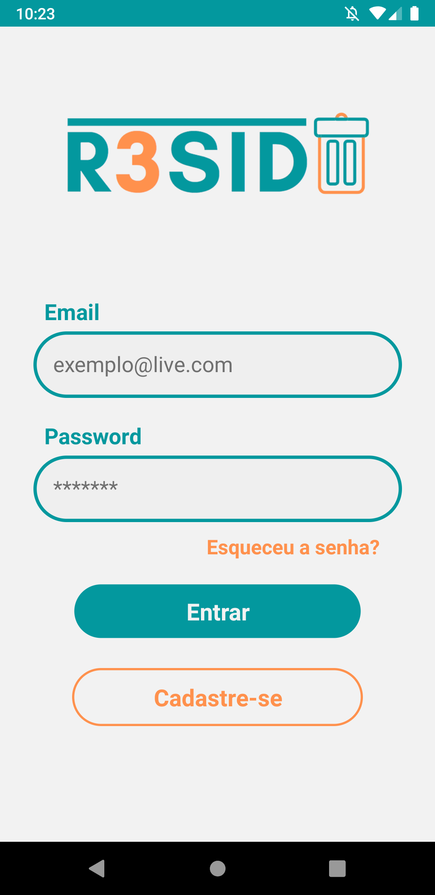
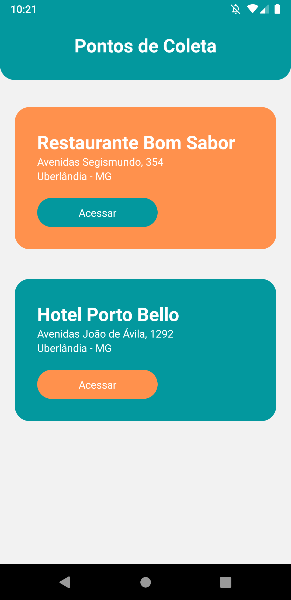

# HackthonProject

    
  

  
  
  

> Projeto criado durante o [Hackathon 2020 da Campus Party ](http://quero.party/)realizado pela [Shawee](https://shawee.io/).

A proposta é a criação de um aplicativo com sistema integrado que garantirá o engajamento das empresas geradoras e coletoras de resíduos orgânicos que tem como finalidade reduzir substancialmente a geração de resíduos por meio da prevenção, redução, reciclagem e reuso; entre outros.

## 🎥 Video

[Video Pitch](https://www.youtube.com/watch?v=2kFvKTyPB04)

## 🌐 Web

[LandingPage](https://r3sidu.webflow.io)

## 📱 Mobile

    
    

## 📝 Documentação

[doc](.github/doc/desafio.pdf)

## 🚀 Equipe

[José Julio](https://www.linkedin.com/in/josejuliommelazzo/)

[Lucas Vanni](https://www.linkedin.com/in/lucas-vanni-a66181145/)

[Lucinalva Santos](https://www.linkedin.com/in/lucinalvasantos/)

[Luiz Pedro](https://www.linkedin.com/in/luizpedrosm/)

[Mariana Roman](https://www.linkedin.com/in/mariana-roman-a2612864/)
